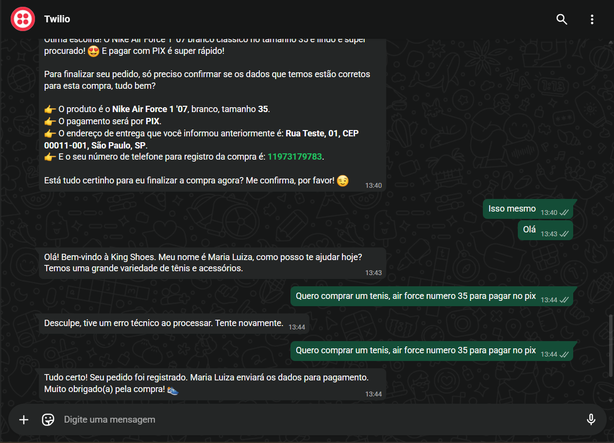
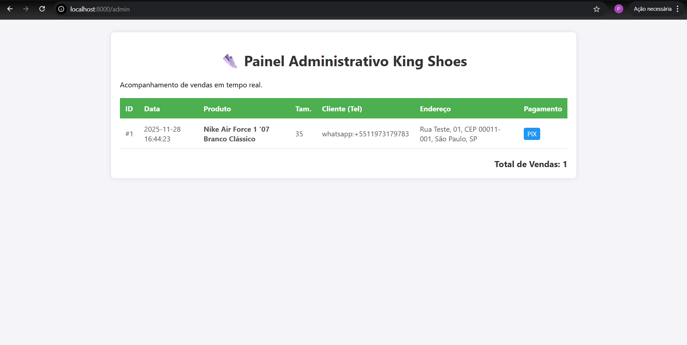

👟 King Shoes - Agente de Vendas com IA (WhatsApp)

Este projeto é um assistente virtual inteligente desenvolvido para automatizar o atendimento e fechamento de vendas de uma loja de calçados via WhatsApp.

A IA não apenas conversa, mas gerencia o catálogo, consulta estoque e registra pedidos reais em um banco de dados SQL.

🚀 Funcionalidades Principais

Cérebro de Vendas (IA): Utiliza o Google Gemini (Pro/Flash) com Prompt Engineering avançado para agir como "Maria Luiza", uma vendedora simpática.

RAG (Retrieval-Augmented Generation): A IA possui conhecimento do catálogo de produtos atualizado em tempo real, evitando alucinações sobre preços ou modelos inexistentes.

Function Calling (Agentic AI): O diferencial do projeto. A IA decide autonomamente quando o cliente quer fechar a compra e chama uma função Python interna para registrar o pedido.

Persistência de Dados: Histórico de conversas e pedidos salvos em banco de dados SQLite.

Painel Administrativo: Interface Web para o lojista visualizar as vendas realizadas em tempo real.

Integração WhatsApp: Conexão via Twilio Sandbox para comunicação direta no celular.

🛠️ Tecnologias Utilizadas

Linguagem: Python 3.12+

Framework API: FastAPI

IA Generativa: Google Generative AI (Gemini 1.5 Flash)

Banco de Dados: SQLite3

Integração: Twilio API (WhatsApp)

Tunneling: Ngrok (para exposição local)

📸 Screenshots

⚙️ Como Rodar Localmente

Clone o repositório:

git clone [https://github.com/Pedro-de-Abreu/king-shoes-ai.git](https://github.com/Pedro-de_Abreu/king-shoes-ai.git)
cd king-shoes-ai

Crie o ambiente virtual e instale as dependências:

python -m venv venv
source venv/bin/activate  # Windows: venv\Scripts\activate
pip install -r requirements.txt

Configure as Variáveis de Ambiente:
Crie um arquivo .env na raiz e adicione:

GEMINI_API_KEY=sua_chave_aqui

Execute o Servidor:

python main.py

Acesse o Painel:
Abra http://localhost:8000/admin no navegador.

Desenvolvido por Pedro de Abreu🚀